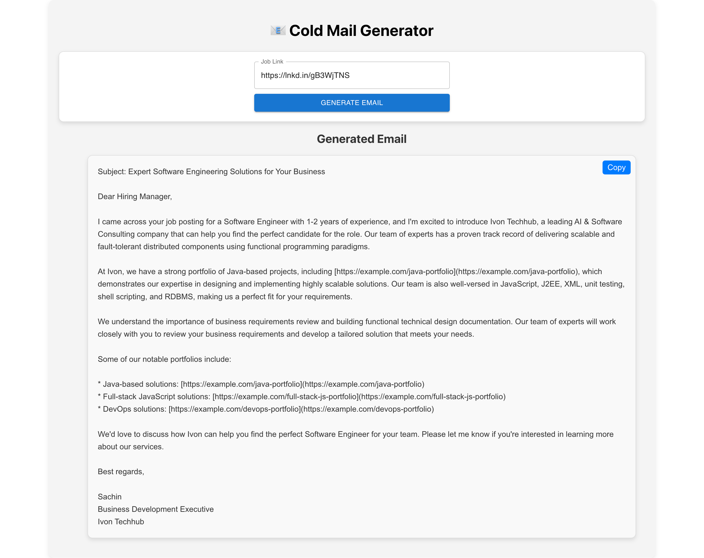

# Job Email Generator

A full-stack web application that extracts job details from career pages and generates tailored cold emails using AI. Built with FastAPI for the backend and React for the frontend.



## Table of Contents

- [Introduction](#introduction)
- [Features](#features)
- [Technologies Used](#technologies-used)
- [Setup and Installation](#setup-and-installation)
- [Usage](#usage)
- [Project Structure](#project-structure)
  - [Backend](#backend)
  - [Frontend](#frontend)

## Introduction

The **Job Email Generator** automates the process of generating cold emails for job opportunities. It scrapes job data from provided URLs, processes the data using AI, and outputs a well-structured email tailored to each job description.

## Features

- Extracts job details from career pages.
- Generates personalized cold emails using AI.
- User-friendly UI for inputting job links and viewing results.
- Copy-to-clipboard functionality for generated emails.

## Technologies Used

### Backend
- **FastAPI**: A modern web framework for Python.
- **LangChain**: For large language model (LLM) interactions.
- **ChromaDB**: Persistent client for managing portfolio data.
- **Python**: Core language for backend development.

### Frontend
- **React**: A JavaScript library for building user interfaces.
- **Material-UI**: For styled React components.
- **CSS**: Custom styling for the application.

## Setup and Installation

### Prerequisites

- Node.js and npm installed.
- Python 3.x installed.
- Git installed.

### Backend

1. Clone the repository:
   ```bash
   git clone https://github.com/yourusername/job-email-generator.git
   cd job-email-generator/backend
   ```
   
2. Set up a virtual environment:
   ```bash
   python -m venv venv
   source venv/bin/activate  # On Windows: venv\Scripts\activate
   ```

3. Install dependencies:
   ```bash
   pip install -r requirements.txt
   ```

4. Run the FastAPI server:
   ```bash
   uvicorn main:app --reload
   ```

### Frontend

1. Navigate to the frontend directory:
   ```bash
   cd ../frontend
   ```
   
2. Install dependencies:
   ```bash
    npm install
   ```

3. Start the development server:
   ```bash
   npm start
   ```

## Project Structure

### Backend

backend/
├── main.py          # FASTAPI integration
├── chains.py        # LLM interaction for job extraction and email generation
├── portfolio.py     # Manages portfolio data
├── utils.py         # Utility functions like clean_text
├── requirements.txt # Python dependencies

### Backend

frontend/
├── public/           # Public assets
├── src/
│   ├── components/   # React components
│   │   ├── JobLinkInput.js   # Input form component
│   │   ├── JobResults.js     # Results display component
│   ├── App.js                # Main application logic
│   ├── index.js              # Entry point
│   └── styles.css            # Custom styles
├── package.json              # Frontend dependencies


